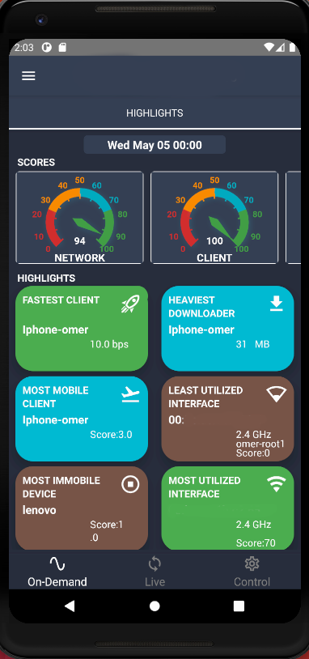

# Contents
* [About](#about)
* [Installation](#installation)
* [Tools and Technologies](#tools-and-technologies)
* [Main Features](#main-features)


# About

This React Native-based sample application is a high-level mobile application that allows customers to view and manage their home network data. One of the most important features is that customers can set up and access their APs (access points). Customers can also change the SSID and password of their AP. In addition, customers can view the data of their access point and see how many and which devices are connected (e.g. IPHONE, Lenovo).

It has some functions for the administrator:

* View specific AP data as periodic or live data.
* Manage specific AP /device configurations
* Track the usage of customer data

It also provides some functions for normal users:

* Authentication - (log in, renew password, confirm account, log out)
* View hourly, daily and monthly data of own AP
* View live data of own AP
* Change the manufacturer name of the devices as friendly name in the charts.
* Change SSID/Password
* Configure access control


## Tools and Technologies

* React Native
* E-Charts
* JavaScript
* TypeScript
* Third Party Libraries: Splash Screen,Material Icons,Async Storage,React Navigation

## Installation

```bash
npm install
```

```bash
react-native run-android
```

## Main Features

### Authentication


### Account


### Highlights


### Overview 


### Topology


## License
[GNU 3.0](https://github.com/omeraydemirr/wireless-app/blob/16ed234da6fff3fff3cde9844faa654ca3c6087f/LICENSE)
